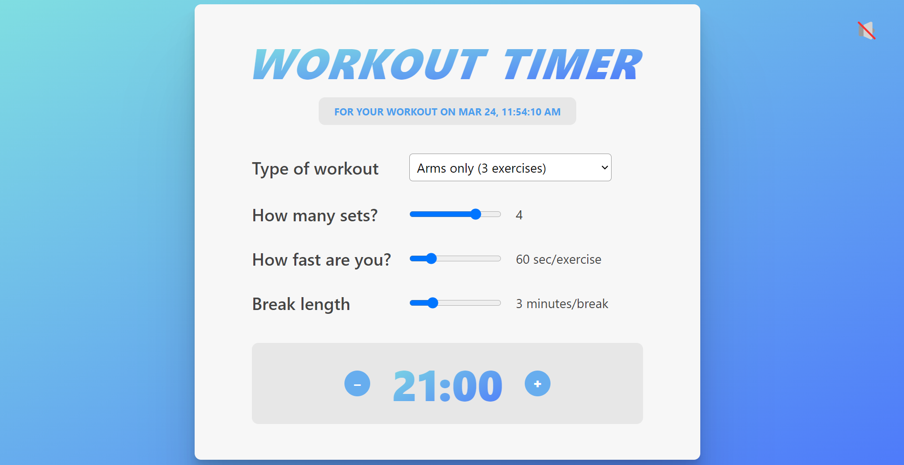

# Workout Timer ⏱️

Welcome to the Workout Timer repository! Your personal trainer for efficient and customizable workouts! 💪

  

## Description 📝

Workout Timer is a React-based web application designed to help you optimize your workout sessions. With features like sound toggle, customizable timer, exercise types, and prediction of workout duration, it provides a seamless experience for your fitness routines.

## Key Features 🌟

- **Customizable Timer**: Set the timer duration and intervals according to your workout preferences.
- **Sound Toggle**: Control the sound effects during your workout sessions with a simple toggle.
- **Exercise Types**: Choose from a variety of exercise types and customize the number of sets.
- **Workout Duration Prediction**: Get an estimated workout duration based on your selected exercises and rest intervals.

## Technologies Used 🛠️

- **React**: JavaScript library for building user interfaces.
- **Git version control**: Manage and track changes in the codebase.
- **Visual Studio Code**: Development environment for coding and testing.

